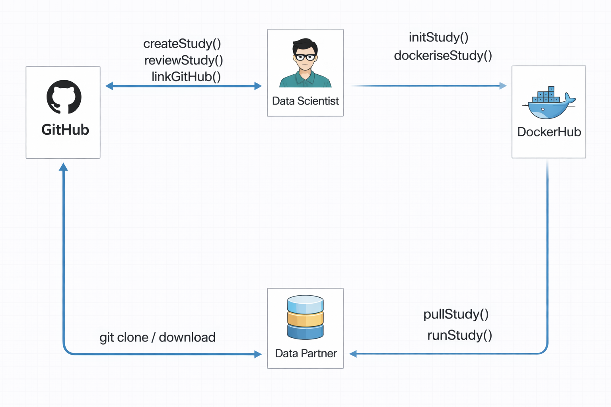

## OmopStudyBuilder

<!-- Standardised scaffolding, automated review, and flexible execution for OMOP network studies. -->


## Background

- Multi-site OMOP studies face long-term reproducibility challenges.
- `renv` helps short-term collaboration, but long-term reproducibility can still break.
- Common failure points include:
  - Different R versions used at restore time.
  - Operating system and software differences across partner sites.
  - Hidden system requirements such as Java, curl, and other shared libraries.
- Containers improve portability, but not every data partner can adopt Docker because of local IT and security restrictions.

## What is `renv`?

Records exact R package versions so any partner can restore the same study environment.

- Records the exact version of every R package used by the study.
- A partner runs `renv::restore()` and reinstalls the same package set with no version drift.
- The environment is described in a single `renv.lock` file that travels with the study code.

## What is `Docker`?

Docker is a shipping container for the full software environment.

- Packages study code, R version, and system libraries into a single image.
- A partner runs the image and gets the same OS-level runtime, R version, and package stack.
- The image can also expose RStudio Server, so partners still work in a familiar interface.

. . .

Docker must be installed on the machine to use this option.

## Where This Sits

::: columns
::: {.column width="33%"}
### Arachne

- UI-driven platform for network studies.
- Requires setup, hosting, and maintenance.
- Does not itself guarantee reproducibility of study code.
:::

::: {.column width="33%"}
### Ulysses

- Templates study execution workflows.
- Closer to a Strategus-style execution model.
- More orchestration-focused than package-first.
:::

::: {.column width="34%"}
### OmopStudyBuilder

- Lower-level, code-first approach.
- Standardises the project itself.
- Supports both `renv` and optional containerisation.
:::
:::

## What OmopStudyBuilder Does

- An opinionated R package that standardises how studies are:
  - Created with a consistent project structure and templates.
  - Reviewed with code and dependency checks.
  - Distributed as a shareable folder with optional Docker image publishing.
- Ships templates for:
  - Study code.
  - Diagnostics code.
  - Shiny applications.

# Workflow

## The Workflow

Create study -> Write study code -> Record dependencies -> Review -> Build image -> Run -> Share

::: {.workflow-layout}
::: {.workflow-visual}
{.workflow-diagram}
:::

::: {.workflow-notes}

- Data partners can choose their execution mode.
- Option A: run from source with `renv.lock`.
- Option B: run the Docker image for stronger long-term reproducibility.
- Docker commands are wrapped in R functions, so users do not need to work directly with the CLI.
:::
:::

## Why Two Execution Modes?

- Some partners cannot install or run Docker.
- Some studies need a portable runtime across sites for long-term reuse.
- OmopStudyBuilder keeps both paths available in the same study package.

# Approach

## Scaffolding

```r
library(here)
library(OmopStudyBuilder)

initStudy(here("SampleStudy"))

```

::: {.cell-output .cell-output-stdout}
```r
✔ SampleStudy # prepared as root folder for study
✔ SampleStudy/diagnosticsCode # prepared for study diagnostics code
✔ SampleStudy/diagnosticsShiny # prepared for diagnostics shiny app
✔ SampleStudy/studyCode # prepared for study study code
✔ SampleStudy/studyShiny # prepared for study shiny app
```
:::

- Creates the initial directory structure for an OMOP CDM network study.
- Gives teams a standard starting point instead of custom folders for each project.

## Review

```r
library(here)
library(OmopStudyBuilder)

reviewStudy(here())
```

- Reviews study code.
- Summarises dependencies captured in `renv.lock`.
- Helps identify missing requirements before a study is distributed.

## Docker

```r
library(OmopStudyBuilder)

dockeriseStudy()
pushDockerImage()
```

- Builds a Docker image for the study.
- Pushes that image to Docker Hub or another registry for partner reuse.

## Typical Workflow

::: {.fragment .workflow-step}
```r
library(OmopStudyBuilder)
```
:::

::: {.fragment .workflow-step}
```r
initStudy()
```
:::

::: {.fragment .workflow-step}
```r
# write study code
```
:::

::: {.fragment .workflow-step}
```r
reviewStudy()
```
:::

::: {.fragment .workflow-step}
```r
linkGitHub() / dockeriseStudy()
```
:::

::: {.fragment .workflow-step}
```r
pushDockerImage()
```
:::

::: {.fragment .workflow-step}
```r
runStudy()
```
:::

- The package supports the study lifecycle from setup through execution and sharing.

## Execution Experience

```r
library(OmopStudyBuilder)

runStudy(interactive = TRUE)
```

- Runs RStudio Server for interactive study execution.
<!-- - Also supports automated execution with real-time log streaming. !-->
- Expects a `.env` file in the project root for runtime configuration.

## What This Improves

- Site differences are reduced when partners use the same image.
- The runtime stays aligned across:
  - R version.
  - Operating system and system dependencies.
  - Installed R packages.
- OmopStudyBuilder smooths over practical rough edges such as:
  - Docker availability checks.
  - Automatic port selection.
  - Clearer execution errors.

## OmopStudyBuilder

::: {style="display: flex; align-items: center; justify-content: space-between; gap: 2rem;"}
::: {style="flex: 1;"}

👉 [GitHub repository](https://github.com/oxford-pharmacoepi/OmopStudyBuilder)

📧 <a href="mailto:folu.akintola@ndorms.ox.ac.uk">folu.akintola@ndorms.ox.ac.uk</a>
:::

::: {style="flex: 1; text-align: center;"}

:::
:::
